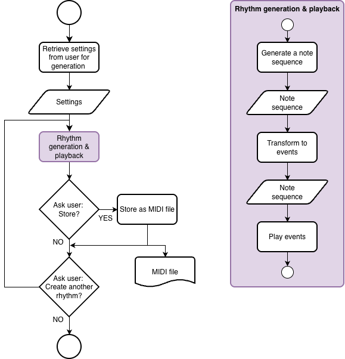

# Irregular Beat Generator
***Eindopdracht CSD2a***

## Omschrijving
Voor het blok csd2a maak je een Irregular Beat Generator command line programma waarmee een gebruiker onregelmatige ritmes kan generen. Het programma genereert en speelt een ritme met behulp van audio samples.

## Flow
De flow van de Irregular Beat Generator (`IBG`) is als volgt:
- De gebruiker kan de keuze maken uit minimaal twee onregelmatige maatsoorten (bijvoorbeeld 5/4 of 7/8).
- De gebruiker kan daarna het tempo in BPM invoeren.
- [OPTIONAL] De gebruiker kan kiezen welke sample files gebruikt worden.
- De `IBG` speelt vervolgens een beat in de geselecteerde maatsoort. Om de beat duidelijk te laten horen wordt deze een aantal malen herhaald. _(Bij de eindpresentatie minimaal vier maal.)_
- De `IBG` vraagt aan de gebruiker of de afgespeelde beat als MIDI file moet worden geëxporteerd.
- De `IBG` vraagt aan de gebruiker of er nog een beat gemaakt moet worden:
  - "N"? --> de `IBG` wordt afgesloten.
  - "Y"? --> de flow begint opnieuw.

  

Figuur 1. Program flow

## Voorwaarden eindresultaat
- De IBG is een command line programma, de interactie met de gebruiker verloopt via de console (a.k.a. terminal), dus zonder GUI.
- De gegenereerde beats zijn opgebouwd uit drie verschillende geluiden, verdeeld over
het spectrum: laag, midden en hoog.
- De beat wordt gegenereerd aan de hand van een algoritme dat rekening houdt met de
gekozen maatsoort en een logische ritmische onderverdeling van de verschillende
geluiden. Bovendien wordt een zekere mate van randomness toegepast zodat de
resulterende beats elke keer anders zijn. Bij de eindpresentatie moet je kunnen verantwoorden hoe je tot dit algoritme gekomen bent en wat de muzikale betekenis ervan is.
- De IBG is in staat om de gegenereerde beat herhaaldelijk af te spelen. Bij de eindpresentatie wordt dezelfde beat minimaal vier maal herhaald.
- Presenteer het eindresultaat in de zesde sessie van dit blok.
- Het eindresultaat, documenten en presentatie voldoen aan de algemene randvoorwaarden, zie beoordelingscriteria document.
