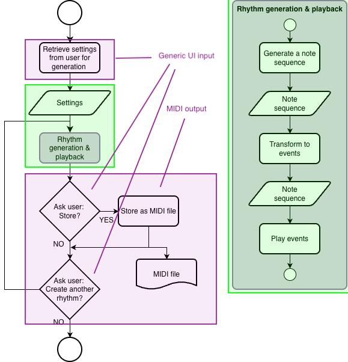

# Session 5

## Repos
Number of commits per week?

## Hoe gaat het? & Hoe is het gegaan met de opdrachten

- Eindopdracht, het omzetten van stappen / pseudo code naar python code
  - het generatie deel
  - functies
  - dictionaries

- Hoe is het gegaan met het zelfstandig doornemen en leren werken met dictionaries? Zijn hier nog vragen over? _--> vragen verzamelen voor straks_

## Content

- losse python files, code modulair opzetten mbv functies & losse files
  _Wat breng je in welke files onder?_

- example 5a demonstrates how to import another local python description

### UI
- example 5b, short example that demonstrates validation of user input
- example 5c, 5d and 5e, functions / modules that can be used in the main assignment

### MIDI
Pretty straightforward - see session5/MIDI directory

### Assignments next week
- Finish the project code base
- Prepare presentation
- Finalize documentation

--> see __deliverables_deadlines.md_

**_Who is going to present next week?_**
